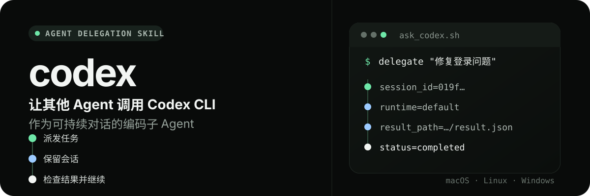
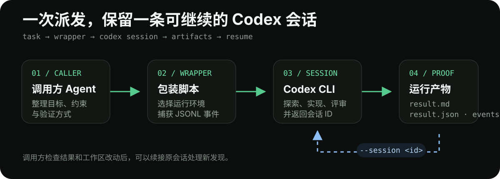

<p align="center">
  
</p>

`codex` 是一个供其他 Agent 调用的 Skill。它通过包装脚本把代码探索、实现、评审和验证任务交给 Codex CLI，同时保留会话 ID、结构化状态和完整事件记录。

调用方负责说明目标、约束和验收方式；Codex 负责在指定工作区内完成任务。一次任务结束后，调用方可以检查结果，也可以继续同一个会话处理后续问题。

## 适合处理的任务

- 探索代码库，追踪入口、依赖和调用链。
- 实现边界清楚的功能或修复。
- 只读评审代码，并引用具体文件和行号。
- 运行测试、类型检查或构建，整理验证结果。
- 继续已有 Codex 会话，不重复传递完整背景。

## 安装

```bash
npx skills add oil-oil/codex -g -y
```

运行前需要准备：

- 已安装并登录 [Codex CLI](https://github.com/openai/codex)。
- macOS、Linux 或 Windows。
- `jq`。包装脚本使用它处理 Codex 的 JSONL 事件。

安装后，其他 Agent 可以在用户明确要求“使用 Codex”时调用这个 Skill。

## 让 Agent 调用 Codex

可以直接向支持 Skill 的 Agent 提出要求：

```text
使用 Codex 检查这个项目的登录流程，修复刷新失败的问题，并运行相关测试。
```

Agent 会整理任务目标、完成标准、重要文件和安全边界，再调用包装脚本。调用方仍然负责检查工作区改动和重新运行真实验证命令。

## 包装脚本

macOS 与 Linux：

```bash
~/.agents/skills/codex/scripts/ask_codex.sh \
  "检查登录流程，修复刷新失败的问题，并运行相关测试" \
  --workspace "/path/to/repo" \
  --file "src/auth.ts"
```

Windows：

```powershell
~/.agents/skills/codex/scripts/ask_codex.ps1 `
  "检查登录流程，修复刷新失败的问题，并运行相关测试" `
  -Workspace "C:\path\to\repo" `
  -File "src\auth.ts"
```

脚本默认创建可写的新会话。探索、讨论和评审任务应使用只读模式：

```bash
~/.agents/skills/codex/scripts/ask_codex.sh \
  "追踪请求路径，并引用涉及的文件和行号" \
  --workspace "/path/to/repo" \
  --read-only
```

## 调用流程

<p align="center">
  
</p>

每次运行都会建立独立的产物目录，避免并行任务互相覆盖。脚本成功后输出：

```text
session_id=<thread_id>
runtime=<default|deepseek>
output_path=<path>
result_path=<path>
events_path=<path>
elapsed=<seconds>s
```

调用方通常先读取 `output_path`，再检查工作区和验证结果。运行失败时，可以通过 `result_path` 和 `events_path` 判断失败原因。

| 产物 | 内容 | 使用场景 |
| --- | --- | --- |
| `output_path` | 精简的 Markdown 结果 | 阅读结论、改动与有效执行记录 |
| `result_path` | 结构化运行状态 | 判断成功、失败、退出码和会话信息 |
| `events_path` | Codex 原始 JSONL 事件 | 诊断中断、错误和恢复问题 |

## 继续已有会话

首次任务返回 `session_id` 后，可以继续同一个 Codex 会话：

```bash
~/.agents/skills/codex/scripts/ask_codex.sh \
  "继续修复刚才发现的问题，并补充回归测试" \
  --session <session_id>
```

续接会话会保留原工作区和沙箱权限，因此不能同时传入 `--read-only` 或新的 `--sandbox`。

## 运行环境

包装脚本会自动选择本机已经配置的 Codex 运行环境：

- 存在有效的 `~/.codex-deepseek/config.toml` 时，使用 DeepSeek Codex。
- 未配置 DeepSeek 时，使用默认 Codex。

常规调用不需要指定模型、Provider 或思考强度。默认思考强度为 `high`；只有任务确实需要时，才使用 `--reasoning low` 或 `--reasoning max` 覆盖。

DeepSeek V4 Flash 只接受文本。启用 DeepSeek 运行环境后，包装脚本会拒绝 `--image`。调用方应先识别图片，再把页面结构、文字、颜色、尺寸和异常点整理成文字背景。

## 常用参数

| 参数 | 作用 |
| --- | --- |
| `--workspace <path>` | 指定 Codex 工作目录 |
| `--file <path>` | 提供优先阅读的入口文件，可以重复使用 |
| `--read-only` | 创建只读会话 |
| `--session <id>` | 继续已有会话 |
| `--ephemeral` | 不持久化新会话 |
| `--output-schema <path>` | 使用 JSON Schema 约束最终结果 |
| `--image <path>` | 向默认 Codex 运行环境附加图片 |
| `--reasoning <level>` | 在必要时覆盖默认思考强度 |
| `--notify` | 长任务结束后发送桌面通知 |
| `--output <path>` | 指定 Markdown 结果路径 |

完整参数可以通过脚本的 `--help` 查看。

## 委托和验收

每次只委托一个边界清楚的任务。提示词应当说明：

1. 需要修改或查明什么，以及不应改动的范围。
2. 预期行为和必须覆盖的边界情况。
3. 需要运行的真实测试、检查或构建命令。
4. 不执行 `git add`、`git commit`，不顺手重构无关代码。
5. 最终报告需要包含改动原因、涉及文件、验证结果和未完成事项。

Codex 返回“测试通过”不能替代调用方验收。调用方需要检查测试是否被删除、跳过或弱化，并重新运行仓库中的真实验证命令。

## 开发验证

macOS 与 Linux 包装脚本的回归测试：

```bash
bash tests/test_ask_codex.sh
```

测试覆盖成功运行、完整失败和已经返回会话 ID 的中途失败。

## 配置、依赖与使用边界

需要 Codex CLI 与官方登录；macOS/Linux 使用 Bash，Windows 使用 PowerShell。包装脚本可从任意实际 Skill 目录调用。

仅在用户明确要求委托时使用。任务文件与指令会交给 CLI 配置的模型；继续原会话时核对会话与目录，避免混入无关任务。

使用示例：

```text
用 Codex 处理这个明确的代码修改。
```
